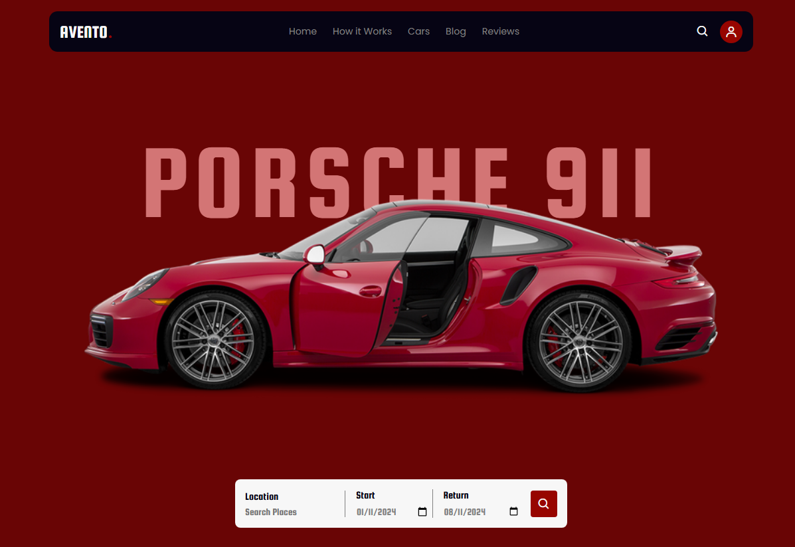

# PP - 002 Car rental 

## Overview
This is my personal project based on a car rental.
 This was based on a project from Web Design Mastery (https://webdesignmastery.github.io/Rental_07-09-24/). 
I tweaked the landing page and added my own sections like FAQ, Fleet model selector.
I used a tutorial to further my understanding on hamburger menus and the logo carousel.

### Screenshot

### Links

- Solution URL: (https://rajancp.github.io/PP-002-Car-rental/)

### Built with

## Author

- Frontend Mentor - [@RajanCP](https://www.frontendmentor.io/profile/RajanCP)
- GitHub - [@RajanCP] (https://github.com/RajanCP)

